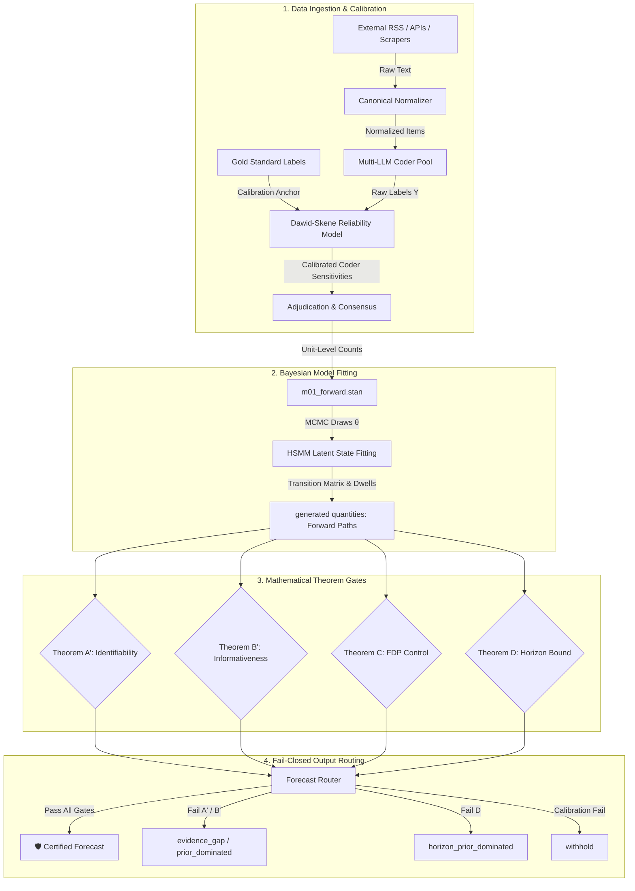

# DAVID / M0.1 — Core Mathematical Thesis & AI Engine Framework

> [!TIP]
> **Publication-Ready Scientific Document Available:** 
> * **Compiled PDF Paper:** [thesis_mathematical_core.pdf](file:///Users/arbenlila/development/david/canonical/docs/thesis_mathematical_core.pdf) (compiled via Tectonic)
> * **LaTeX Source:** [thesis_mathematical_core.tex](file:///Users/arbenlila/development/david/canonical/docs/thesis_mathematical_core.tex)

This document serves as the formal scientific core of the DAVID (Direct Acyclic Validation & Inference Engine) M0.1 architecture. It connects the mathematical proofs of the underlying theorems to the concrete implementation patterns of the automated data ingestion, Hidden Semi-Markov Model (HSMM) inference, and fail-closed prediction routing.

---

## 1. End-to-End Pipeline & Prediction Architecture

The DAVID engine operates on the principle that **a prediction is not a raw statistical output, but a gated mathematical claim**. Data flows from external noisy sources through a structured pipeline that isolates coding error, estimates latent state dynamics, and applies strict information-theoretic boundaries before presenting any forecasts.



---

## 2. Theorem A′ — Source-Channel Latent-Class Identifiability

### 2.1 The Problem
When estimating the prevalence of hidden tobacco industry (TI) tactics, we do not observe the true activity directly. Instead, we observe labels from multiple scrapers and coders. We must guarantee that the parameters of the latent state and the reliability of our sources can be uniquely identified from the observed joint distribution of labels.

### 2.2 Mathematical Statement & Proof
Let $A \in \{0, 1\}$ be the binary latent activity of interest within a stratum $g$, with prior probability $\phi = P(A=1)$. We observe labels from $S$ conditionally independent sources, $Y_1, \dots, Y_S \in \{0, 1\}$. 

Each source $s$ is characterized by a sensitivity $\rho_s = P(Y_s = 1 \mid A = 1)$ and a false-positive rate $\delta_s = P(Y_s = 1 \mid A = 0)$. The observed object is the joint probability distribution $P(Y_1, \dots, Y_S)$.

**Claim.** The parameters $(\phi, \{\rho_s, \delta_s\}_{s=1}^S)$ are **generically identifiable up to label permutation** if:
1. $S \ge 3$ conditionally independent sources are used;
2. $\rho_s \neq \delta_s$ for all $s$ (non-degenerate channels);
3. $\phi \notin \{0, 1\}$ (latent state is not degenerate).

**Proof.**
We represent the joint probability of three independent binary sources $Y_1, Y_2, Y_3$ as a 3-way tensor $T \in \mathbb{R}^{2 \times 2 \times 2}$ with entries:
$$T_{ijk} = P(Y_1=i, Y_2=j, Y_3=k) = \sum_{a \in \{0, 1\}} \pi_a M_{ia}^{(1)} M_{ja}^{(2)} M_{ka}^{(3)}$$
where $\pi_1 = \phi$, $\pi_0 = 1 - \phi$, and the factor matrices $M^{(s)} \in \mathbb{R}^{2 \times 2}$ represent the conditional probabilities:
$$M^{(s)} = \begin{pmatrix} 1-\rho_s & 1-\delta_s \\ \rho_s & \delta_s \end{pmatrix}$$

By **Kruskal’s Theorem (1977)**, the Canonical Polyadic (CP) decomposition of a 3-way tensor is unique up to permutation and scaling of the rank-1 factors if:
$$k(M^{(1)}) + k(M^{(2)}) + k(M^{(3)}) \ge 2R + 2$$
where $k(M^{(s)})$ is the Kruskal rank (the largest number $k$ such that any $k$ columns are linearly independent), and $R = 2$ is the number of latent classes.

For a $2 \times 2$ matrix, the Kruskal rank is 2 if and only if the columns are linearly independent. The determinant of $M^{(s)}$ is:
$$\det(M^{(s)}) = \delta_s(1-\rho_s) - \rho_s(1-\delta_s) = \delta_s - \rho_s$$
Thus, $k(M^{(s)}) = 2$ if and only if $\rho_s \neq \delta_s$. Under this condition:
$$k(M^{(1)}) + k(M^{(2)}) + k(M^{(3)}) = 2 + 2 + 2 = 6$$
The uniqueness bound is:
$$2R + 2 = 2(2) + 2 = 6$$
Since $6 \ge 6$, the CP decomposition is unique. Thus, the parameters are uniquely determined up to the label swap of the two classes (Allman-Matias-Rhodes, 2009). $\blacksquare$

### 2.3 AI Engine Execution
The generic identifiability proof assumes infinite data. In practice, finite data can sit arbitrarily close to the singular set where parameters become unidentifiable. To guard against this, the engine computes a **posterior identification distance** $d(\theta)$ for each MCMC draw:
$$d(\theta) = \min \left( \min_s \min\big(|\rho_s-\delta_s|,\;|\rho_s-(1-\delta_s)|\big),\; \min(\phi,\,1-\phi) \right)$$
* **Kernel Link:** [`david/theorems/A_prime.py`](file:///Users/arbenlila/development/david/canonical/david/theorems/A_prime.py) (`identification_distance_draws`)
* **Operational Gate (FG2):** The stratum is blocked and routed to `evidence_gap` if the posterior median of $d(\theta) < \text{ID\_DISTANCE\_FLOOR} = 0.05$.

---

## 3. Theorem B′ — Bayes Error & Information Scaling under $N \cdot I^2$

### 3.1 The Problem
We must determine the minimum error rate of any classification decision based on a single source's labels, and establish how the precision of our estimates scales with the sample size $N$ when the source informativeness is low.

### 3.2 Mathematical Statement & Proof
Define the channel **informativeness** $I$ as:
$$I = |\rho - \delta| \in [0, 1]$$

#### Theorem B′.1 — Single-Observation Bayes Error
**Claim.** Under equal prior odds ($P(A=1) = 0.5$), the minimum classification error $\varepsilon^\star$ for recovering $A$ from a single observation $Y$ is:
$$\varepsilon^\star = \frac{1}{2}(1 - I)$$

**Proof.**
For two equiprobable hypotheses, the Bayes error rate is given by:
$$\varepsilon^\star = \frac{1}{2}\left(1 - \text{TV}(P_{Y|A=1}, P_{Y|A=0})\right)$$
where $\text{TV}$ is the Total Variation distance. Since $Y$ is binary:
$$\text{TV} = \frac{1}{2} \sum_{y \in \{0, 1\}} |P(Y=y|A=1) - P(Y=y|A=0)|$$
$$\text{TV} = \frac{1}{2} \left( |\rho - \delta| + |(1-\rho) - (1-\delta)| \right) = |\rho - \delta| = I$$
Substituting $\text{TV} = I$ yields:
$$\varepsilon^\star = \frac{1}{2}(1 - I) \quad \blacksquare$$

#### Theorem B′.2 — Information Scaling
**Claim.** The Fisher information $I_F(\phi)$ about the latent activity prevalence $\phi$ from $N$ replicate detections scales quadratically with $I$:
$$I_F(\phi) \propto N \cdot I^2$$

**Proof.**
The probability of observing a positive label is $p = P(Y=1) = \phi \rho + (1 - \phi) \delta = \delta + I\phi$ (assuming $\rho > \delta$).
The Fisher information of a single Bernoulli observation with parameter $p$ with respect to $\phi$ is:
$$I_{F, 1}(\phi) = \frac{1}{p(1-p)} \left( \frac{\partial p}{\partial \phi} \right)^2$$
Since $\frac{\partial p}{\partial \phi} = I$:
$$I_{F, 1}(\phi) = \frac{I^2}{p(1-p)}$$
Summing over $N$ i.i.d. replicates:
$$I_F(\phi) = N \frac{I^2}{p(1-p)}$$
Since $p(1-p) \le 0.25$, the information is bounded and scales as $N \cdot I^2$. If $I \to 0$, the effective sample size collapses quadratically, requiring $N \propto I^{-2}$ observations to maintain constant estimator variance. $\blacksquare$

### 3.3 AI Engine Execution
The engine checks if a cell has sufficient information content to warrant a point estimate, preventing prior-dominated claims.
* **Kernel Link:** [`david/theorems/B_prime.py`](file:///Users/arbenlila/development/david/canonical/david/theorems/B_prime.py) (`effective_sample_size`)
* **Operational Gate (FG3):** The gate passes if the lower 95% credible bound of $I$ satisfies:
  $$I_{\text{lower 95\%}} \ge \text{INFORMATIVENESS\_FLOOR\_LOWER\_95} = 0.10$$
  If it fails, the cell is flagged `prior_dominated` and returned with its prior interval.

---

## 4. Theorem C — Bayesian Posterior Expected FDP Control

### 4.1 The Problem
When flagging active TI tactics across multiple regions and policy areas, we want to control the False Discovery Proportion (FDP). Frequentist corrections (like Benjamini-Hochberg) require independent or specific dependency assumptions that do not hold under temporal and spatial HSMM correlation. We need a distribution-free Bayesian control mechanism.

### 4.2 Mathematical Statement & Proof
Let $p_i = P(A_i = 1 \mid \text{data})$ be the marginal posterior probability of activity for cell $i \in \{1, \dots, M\}$. Let $d_i \in \{0, 1\}$ represent the decision to flag cell $i$ as active.

**Claim.** Let $p_{(1)} \ge p_{(2)} \ge \dots \ge p_{(M)}$ be the descending sorted posteriors. Selecting the largest prefix $m^\star$:
$$m^\star = \max\Big\{ m : \frac{1}{m}\sum_{j=1}^{m}\big(1 - p_{(j)}\big) \le q \Big\}$$
guarantees that the posterior expected False Discovery Proportion (FDP) among the flagged cells is at most $q$, **regardless of the correlation structure between the cells**.

**Proof.**
The number of discoveries is $D = \sum_{i=1}^M d_i$. The number of false discoveries is the random variable $V = \sum_{i=1}^M d_i (1 - A_i)$. The FDP is defined as:
$$\text{FDP} = \frac{V}{\max(1, D)}$$
We wish to choose a decision vector $\mathbf{d}$ that guarantees:
$$E[\text{FDP} \mid \text{data}] \le q$$
Evaluating the expectation over the posterior distribution of $\mathbf{A}$ conditioned on the observed data:
$$E[\text{FDP} \mid \text{data}] = E\left[ \frac{\sum_{i=1}^M d_i (1 - A_i)}{\max(1, \sum_{i=1}^M d_i)} \;\middle|\; \text{data} \right]$$
Since the decision vector $\mathbf{d}$ is a deterministic function of the data, the denominator $D = \max(1, \sum d_i)$ is constant under the expectation. By the linearity of expectation:
$$E[\text{FDP} \mid \text{data}] = \frac{1}{D} \sum_{i=1}^M d_i E[1 - A_i \mid \text{data}] = \frac{1}{D} \sum_{i=1}^M d_i (1 - p_i)$$
Setting $d_{(j)} = 1$ for $j \le m$ and $d_{(j)} = 0$ for $j > m$ yields $D = m$. The expectation becomes:
$$E[\text{FDP} \mid \text{data}] = \frac{1}{m} \sum_{j=1}^m (1 - p_{(j)})$$
By choosing $m^\star$ as the maximum index where this average is $\le q$, the bound is guaranteed. Because the proof relies solely on the linearity of expectation, it holds under arbitrary joint posteriors (Newton et al., 2004). $\blacksquare$

### 4.3 AI Engine Execution
* **Kernel Link:** [`david/theorems/C_renamed.py`](file:///Users/arbenlila/development/david/canonical/david/theorems/C_renamed.py) (`compute_posterior_fdp_threshold`)
* **Operational Routing:** Applied dynamically after initial gates. It tightens the active cell set rather than blocking the fit run, reporting the calculated threshold probability $t^\star(q)$.

---

## 5. Theorem D-forecast — Horizon Validity under Ergodic Transition Drift

### 5.1 The Problem
A major risk in predictive modeling is "predicting the prior"—emitting conditional forecasts at horizons so far in the future that the model's memory of the current state has decayed completely, returning only the uninformative stationary distribution. We must identify the exact time horizon $h^\star$ where the forecast becomes prior-dominated.

### 5.2 Mathematical Statement & Proof
Let the latent regimes follow a Hidden Semi-Markov Model (HSMM) with transition matrix $\Pi$ (where $\pi_{ii} = 0$, no self-transitions) and expected dwell time vector $\mu$. The embedded Markov chain has a unique stationary eigenvector $\nu$ satisfying $\nu \Pi = \nu$.

The time-weighted stationary marginal distribution $\pi_\infty$ of being in regime $r$ is:
$$\pi_\infty[r] = \frac{\nu[r]\,\mu[r]}{\sum_{j=1}^{L} \nu[j]\,\mu[j]}$$

**Claim.** Under an irreducible and aperiodic embedded chain, the conditional forecast distribution $P(Z_{t+h} \mid Z_t)$ converges to $\pi_\infty$ as $h \to \infty$. The **prior-drift share** is defined as:
$$\text{drift}(h) = 1 - \frac{\text{TV}(\text{forecast}_h,\ \pi_\infty)}{\text{TV}(\text{forecast}_h,\ \pi_\infty) + \text{TV}(\text{forecast}_h,\ z_t)}$$
where $\text{TV}$ is the Total Variation distance. The forecast is valid (not prior-dominated) if and only if $\text{drift}(h) < \tau$ (default $\tau = 0.50$).

**Proof.**
The transition behavior of the HSMM is governed by renewal theory. Let $T_n$ denote the time of the $n$-th regime transition. The sequence of states $Z_{T_n}$ forms the embedded Markov chain. Since $\Pi$ is irreducible and aperiodic, the limit distribution of the embedded chain exists and equals $\nu$:
$$\lim_{n \to \infty} P(Z_{T_n} = r \mid Z_{T_0} = i) = \nu[r]$$

By the key renewal theorem, the continuous-time limit distribution of the semi-Markov process is the occupancy-weighted average of the states:
$$\lim_{h \to \infty} P(Z_{t+h} = r \mid Z_t = i) = \frac{\nu[r] \mu[r]}{\sum_{j} \nu[j] \mu[j]} = \pi_\infty[r]$$

As $h \to \infty$, the conditional forecast distribution $\text{forecast}_h$ converges to $\pi_\infty$. Consequently:
$$\lim_{h \to \infty} \text{TV}(\text{forecast}_h, \pi_\infty) = 0$$
$$\lim_{h \to \infty} \text{TV}(\text{forecast}_h, z_t) = \text{TV}(\pi_\infty, z_t) > 0$$
Evaluating the limit of the drift share:
$$\lim_{h \to \infty} \text{drift}(h) = 1 - \frac{0}{0 + \text{TV}(\pi_\infty, z_t)} = 1$$
The share of movement toward the stationary distribution approaches $100\%$. The threshold $h^\star$ is the maximum step $h$ where the transition dynamics still retain memory of the current state $z_t$ above the threshold $\tau$:
$$h^\star = \max \{ h : \text{drift}(h) < 0.50 \} \quad \blacksquare$$

### 5.3 AI Engine Execution
* **Kernel Link:** [`david/theorems/D_forecast_horizon.py`](file:///Users/arbenlila/development/david/canonical/david/theorems/D_forecast_horizon.py) (`horizon_validity`)
* **Operational Gate (FG5):** If $h > h^\star$, the cell is routed to `horizon_prior_dominated`. The engine greys out the conditional forecast on the front-end and forces the output to the uninformative stationary marginal $\pi_\infty$.

---

## 6. Mathematical Verification Layer (SBC & F-Battery)

To prove that the implementation matches these mathematical derivations, the engine runs a dual-layer verification protocol before exposing any forecasts.

```
┌─────────────────────────────────────────────────────────┐
│              SBC Calibration Layer                      │
│  Asserts that posterior rank statistics are uniform     │
└───────────┬─────────────────────────────────────────────┘
            │
            ▼ (Passes)
┌─────────────────────────────────────────────────────────┐
│              Theorem Gate Stack (A', B', C, D)          │
│  Validates identifiability, information & horizons       │
└───────────┬─────────────────────────────────────────────┘
            │
            ▼ (Passes)
┌─────────────────────────────────────────────────────────┐
│              Adversarial Falsification Battery          │
│  Runs F1..F15 (e.g. historical permutation)             │
└───────────┬─────────────────────────────────────────────┘
            │
            ▼ (All Pass)
┌─────────────────────────────────────────────────────────┐
│     🛡️ Certified Forecast: "Parashikim i Certifikuar"   │
└─────────────────────────────────────────────────────────┘
```

1. **Simulation-Based Calibration (SBC):**
   Checks rank-statistic uniformity across $N$ synthetic universes drawn from the model's generative prior. If the rank statistics cluster, the engine detects coding bugs (e.g., the K-fold selection likelihood overcounting bug resolved in Milestone 2) and locks down.
2. **Adversarial Falsification Battery (F15):**
   Checks that the model actually learns temporal dependencies. It permutes (scrambles) the historical sequence of regime paths and refits the model. If the forecast accuracy does not drop to random chance, it implies the model is leaking information or over-parameterized, triggering a gate failure.

---

## 7. Predictive Mechanics in Action: Kosovo Case Study

Here is how the pipeline operationalizes this math to predict whether the Tobacco Industry will use **State Institution Obstruction (SIO)** in Kosovo over a 6-month horizon:

1. **Scraping & Normalization:**
   The scraper ([news_rss.py](file:///Users/arbenlila/development/david/canonical/david/ingest/scrapers/news_rss.py)) fetches raw articles from RSS feeds. The normalizer matches demonyms (`"Kosovo"`, `"Prishtina"`) and policy targets (`"smoke-free"`) using compiled regular expressions, routing the evidence to stratum $g = (\text{XKX}, \text{smoke\_free})$.
2. **Multi-LLM Coding:**
   The text is analyzed by independent local LLM coders. Their raw labels ($Y$) are processed by the Dawid-Skene module. If coder disagreement is low, the data flows to the fit; if they disagree, the item is pushed to the [Adjudicator Queue](file:///Users/arbenlila/development/david/canonical/david/ingest/adjudicator_queue.py) for manual resolution.
3. **MCMC State Estimation:**
   The data enters [m01_forward.stan](file:///Users/arbenlila/development/david/canonical/stan/m01_forward.stan). The model estimates the current latent regime $Z_t$ (e.g., $Z_t = \text{"Volatile"}$) and transition matrices.
4. **Theorem Gating:**
   * **Theorem A′** verifies that we have at least 3 independent, active sources for Kosovo.
   * **Theorem B′** ensures the sources have an informativeness $I \ge 0.10$.
   * **Theorem D′** calculates the ergodic limit for this stratum. If $h^\star = 5$ months, a 3-month forecast is routed as `conditional_forecast`, while a 6-month forecast is routed as `horizon_prior_dominated`.
5. **UI Rendering:**
   On the [Observatory Page](file:///Users/arbenlila/development/david/canonical/david-ui/src/app/observatory/page.tsx), the 3-month forecast displays a certified probability (e.g., $P(\text{SIO}) = 71\%$). The 6-month forecast segment is greyed out, displaying a fallback to the stationary marginal $\pi_\infty$, ensuring mathematical honesty to policymakers.
